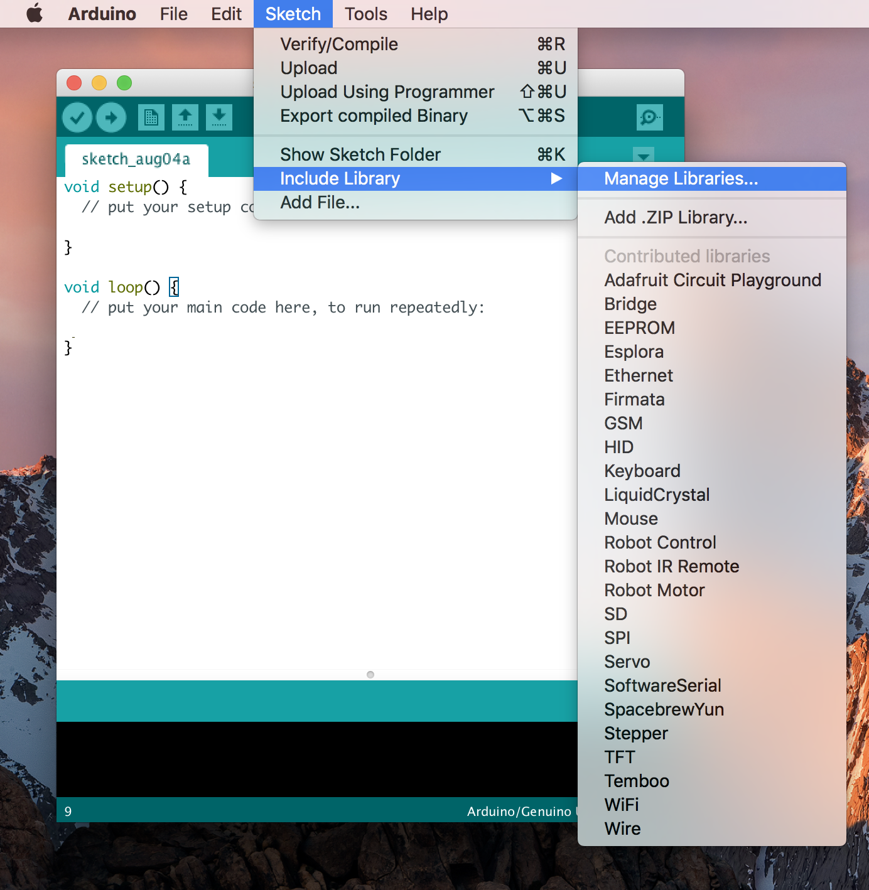

# Getting started with Arduino IDE

This is for IDE level 1.8.5 -- will do our best to keep this updated.

## Conventional Steps with Adafruit Libraries:

1. download from the [official arduino website)(https://www.arduino.cc/en/Main/Software](https://www.arduino.cc/en/Main/Software)
2. add the following line to your Arduino Preferences url
  - https://adafruit.github.io/arduino-board-index/package_adafruit_index.json
  - [see full directions here](https://learn.adafruit.com/add-boards-arduino-v164/setup)
3. add the boards you're using, [see steps here](https://learn.adafruit.com/add-boards-arduino-v164/installing-boards)
4. add any libraries you're using following this documentation, 
