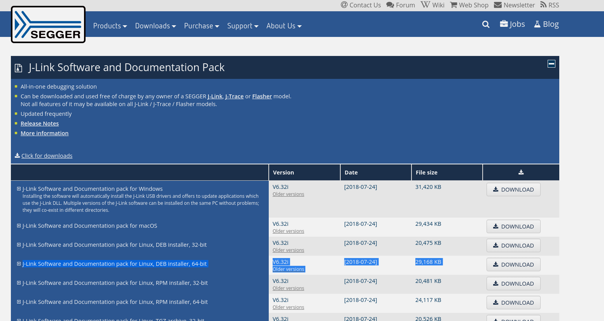

# Getting Started with Nordic

# Programming Cables -- the Segger JLink

Many of the Nordic boards out there come with a Segger JLink built in.

If you want to make your own PCB, recommend to grab a Segger JLink programmer.

# Installation

##  Download the Segger software

Go to: https://www.segger.com/downloads/jlink/ and look for the section shown in image below, and download for your operating system:

## Download the Nordic CLI tools

http://infocenter.nordicsemi.com/index.jsp?topic=%2Fcom.nordic.infocenter.tools%2Fdita%2Ftools%2Fnrf5x_command_line_tools%2Fnrf5x_installation.html

